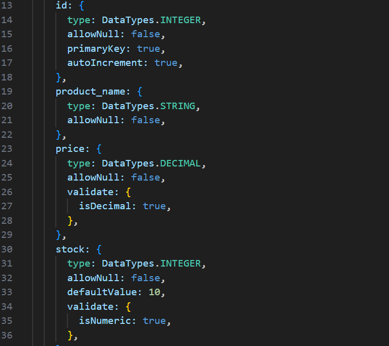

# e-commerce-back-end

## Description
Challenge 13 -- Object-Relational Mapping: E-Commerce Back End

This project was built in order to provide the back end for an e-commerce site, using Express.js API and configuring it in order to use Sequelize for interaction with the MySQL database. This, now back-end completed, site will empower businesses and consumers alike to conveniently engage in online buying and selling of products once the front end is completed and able to be deployed.

Since this project is back end, there will not be a live site to visit, however, you are free to test the back end and server by utilizing the program Insomnia so that you can interact with the database thru Sequelize. If you would just like to view this being done, please visit the [Usage](#usage) section to view a video walkthrough of this being done.

## Table of Contents

- [Installation](#installation)
- [Usage](#usage)
- [Credits](#credits)
- [License](#license)
- [Badges](#badges)
- [Features](#features)
- [Tests](#tests)
- [Questions](#questions)

## Installation

In order to run the program, please use `npm i` in order to install the required dependiencies listed in the package.json being "dotenv", "express", "mysql2", & "sequelize".

In order to runs smoothly, please also update the .env.EXAMPLE file with your own credentials for MySQL and rename the file to just .env so that it will be ignored in any git push.

Also be sure to log into MySQL inside the terminal, and enter both `source schema.sql` & `node seeds/index.js`/`npm run seed` in order to ensure complete connection to the created database.

## Usage

Begin the program by typing into your terminal `node server.js`/`npm run start` or `nodemon server.js`/`npm run watch` (Please make sure to have previously installed the programs dependencies mentioned in the [Installation](#installation) section).

Walkthrough video showing functionality of program:
* Link to walkthrough video: *(click the code snippet)*

## Credits

I recieved some help from my tutor, Bobbi Tarkany, whom assisted in the initilization of database tables and routes functionality. Please check out her work by visiting her [GitHub](https://github.com/bltarkany).

## License

[MIT License](https://opensource.org/licenses/MIT)

## Badges

## Features

For application-specific features, please revisit the [Description](#description) & [Usage](#usage) sections

* JavaScript
* JSON
* Express 
* Node
* MySQL
* Sequilize
* DotEnv
* Nodemon
* Insomnia

## Tests

You can test this back end project by using the program Insomnia so that you can interact with the database thru Sequelize. If you would just like to view this being done, please visit the [Usage](#usage) section to view a video walkthrough of this being done.

## Questions

If you have any questions, feel free to reach out to me via [GitHub](https://github.com/jskelly8/) or email me at jessskelton888@gmail.com.